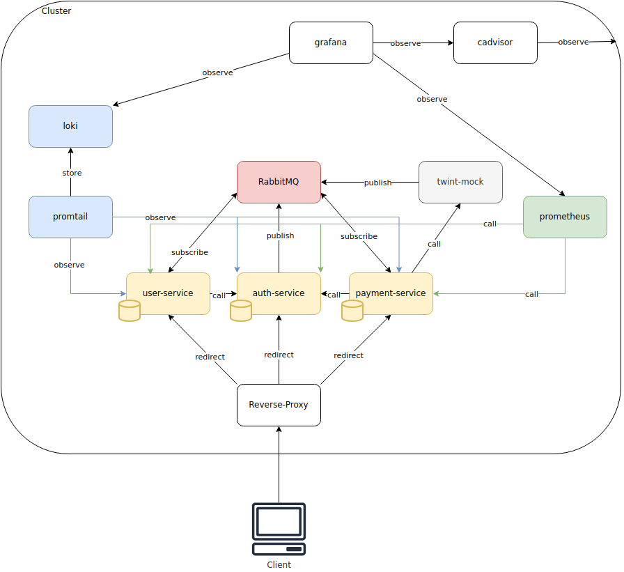

[](https://angular.dev/)
[](https://expressjs.com/)
[](https://www.rabbitmq.com/)
[](https://www.mongodb.com/)
[](https://www.docker.com/)

# xServer :fire:


## Architektur



## Bewertungsraster
- **Maximal erreichbare Punktzahl:** 36 Punkte.  
- **Notwendige Punktzahl für die maximale Bewertung:** 30 Punkte.  
- **Flexibilität:** Nicht alle Kriterien sind zwingend erforderlich, ausser **Kriterium 3**. 
- **Notenberechnung:** Erreichte Punkte / 30 * 5 + 1

| #  | Kriterium                         | Max. Punkte  | Beschreibung  | Erreichte Punkte |
|----|----------------------------------|-------------|--------------|-----------------|
| 1  | Dokumentation                   | 3           | Projektbeschreibung und geplantes Vorgehen sind klar und verständlich dokumentiert. | 3 |
| 2  | Technologien                     | 3           | Auswahl und Begründung der verwendeten Technologien sind nachvollziehbar. | 3 |
| 3  | Microservices Anzahl und Kommunikation | 6     | Mindestens zwei Microservices erstellt, die über eine REST API verfügen und über eine Message Queue miteinander kommunizieren. | 6 |
| 4  | Authentifizierung / Sicherheit   | 3           | Zentrale Authentifizierung implementiert, keine separate Authentifizierung für jeden Service. Sicherheitsaspekte berücksichtigt. | 1 |
| 5  | Tests                            | 3           | Funktionalität der Microservices durch Tests (Postman/Bruno) überprüft. | 3 |
| 6  | Logging und Monitoring           | 3           | Log- und Monitoring-Daten werden an einen zentralisierten Dienst übertragen. | 3 |
| 7  | Datenbanken                      | 3           | Microservices verfügen über separate Datenbanken. | 3 |
| 8  | Konfiguration                    | 3           | Die Konfiguration der Microservices ist dokumentiert und implementiert. | 3 |
| 9  | Idempotenz                       | 3           | Mehrere Aufrufe der gleichen Operation führen zu keinen unerwünschten Nebeneffekten. | 3 |
| 10 | CORS                             | 3           | Cross-Origin Resource Sharing ist implementiert. | 3 |
| 11 | Docker-Compose oder Start-Skript | 3           | Docker-Compose / Start-Skript erstellt, das die gesamte Umgebung aufsetzt/startet. | 3 |

## Setup

Um die Anwendung lokal auszuführen, muss das Repository zunächst geklont werden:

```bash
git clone https://git.gibb.ch/mda133769/xserver.git
cd xserver
```

### Lokales Setup mit Docker

Das gesamte System kann mit Docker Compose gestartet werden:

```bash
docker compose -p xserver up -d
```

Nach dem erfolgreichen Start sind folgende Komponenten erreichbar:

- **UI:** [http://localhost:3000](http://localhost:3000)
- **RabbitMQ Management UI:** [http://localhost:15672](http://localhost:15672)

### Entwicklung eines Services oder des Frontends

Falls an einem Service oder dem Frontend entwickelt werden soll, muss der entsprechende Container gestoppt werden, ohne dabei die Datenbanken oder Infrastrukturkomponenten (z. B. RabbitMQ oder Proxy) zu beenden. Danach kann den Anweisungen im README des jeweiligen Services gefolgt werden.


## Commits
Always use a matching gitmoji at the beginning of commit messages. If you don't know which gitmoji to use get the Intellij plugin or consult [gitmoji.dev](https://gitmoji.dev/).